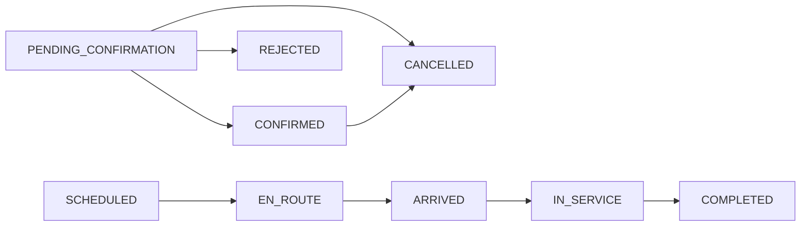

# Foresee Reservation & Operations Platform

## System Architecture, UI/UX and Implementation Plan

> สถานะเอกสาร: Proposed Plan  
> วันที่จัดทำ: 29 สิงหาคม 2569  
> เป้าหมาย: ใช้เป็นเอกสารหลักสำหรับออกแบบ แตกงาน พัฒนา ทดสอบ และส่งมอบระบบ  
> ขอบเขตหลัก: Customer Booking Portal และ Company Operations Center

---

## 1. Executive Summary

ระบบใหม่จะเปลี่ยนจากหน้า Demo ที่รวมข้อมูลจำลองไว้ใน React component เดียว เป็นระบบ Web Application แบบแยกความรับผิดชอบชัดเจน ดังนี้

1. **React SPA** สำหรับส่วนติดต่อผู้ใช้ทั้งหมด
2. **NestJS REST API** เป็นศูนย์กลางของ Business Logic, Validation, Authentication และ Authorization
3. **PostgreSQL** เป็นฐานข้อมูลหลัก
4. **OpenAPI/Swagger** เป็นสัญญากลางระหว่าง Frontend และ Backend
5. **Generated API Client** สร้างจาก OpenAPI เพื่อไม่ให้ Frontend เขียน API types ซ้ำเอง
6. **Versioned Database Migrations** สำหรับเปลี่ยนโครงสร้างฐานข้อมูลอย่างตรวจสอบย้อนหลังได้
7. **Versioned Seeds** สำหรับข้อมูลระบบ ข้อมูล Demo และข้อมูล Test โดยรันซ้ำได้อย่างปลอดภัย
8. **Docker** สำหรับ Development, Test, Staging และ Production
9. **SSE Real-time Updates** สำหรับติดตามการจองและสถานะงาน โดยไม่เพิ่มความซับซ้อนของ WebSocket ตั้งแต่ระยะแรก

ระบบฝั่ง Client แบ่งเป็น 2 ประสบการณ์หลัก แต่ใช้ React application เดียวกัน

- **Customer Booking Portal**: ลูกค้าจองบริการและติดตามเฉพาะรายการของบริษัทตัวเอง
- **Company Operations Center**: ฝั่ง Foresee เห็นและจัดการ Booking, Calendar, รถ, ทีมงาน, SLA, Audit และรายงานทั้งหมด

ภายใน Company Operations Center สามารถมีสิทธิ์ `OWNER`, `ADMIN` และ `STAFF` ได้ แต่ไม่แยกเป็นคนละ Application

---

## 2. Product Goals

### 2.1 เป้าหมายทางธุรกิจ

- ลดการจองผ่านโทรศัพท์และข้อความส่วนตัว
- ให้ลูกค้าสร้างคำขอจองได้ด้วยตัวเอง
- ให้ลูกค้าติดตามสถานะงานได้โดยไม่ต้องโทรสอบถาม
- ให้บริษัทเห็น Booking ทุกงานในจุดเดียว
- ให้ฝ่ายปฏิบัติการรู้ว่างานใดยังไม่ยืนยันหรือยังไม่ได้จัดรถ
- ลดปัญหาการจองชน รถไม่พอ และงานตกหล่น
- มีประวัติว่าใครเปลี่ยนแปลงข้อมูลอะไรและเมื่อไร
- รองรับการต่อยอดไปยัง Notification, Proof of Work, Billing และ GPS ในอนาคต

### 2.2 เป้าหมายทางประสบการณ์ใช้งาน

- ลูกค้าต้องสร้าง Booking ได้โดยไม่ต้องเรียนรู้ระบบ
- ฝั่งบริษัทต้องเห็นสถานการณ์ของวันนี้ภายในหน้าแรก
- Calendar ต้องใช้วางแผนงานได้ ไม่ใช่เพียงบอกว่ามีรายการจอง
- UI ต้องเรียบง่าย อ่านง่าย และเหมาะกับข้อมูลภาษาไทย
- ลดรูปแบบสำเร็จรูปที่ทำให้ดูเหมือน AI-generated dashboard
- ทุก action สำคัญต้องมี feedback และ error message ที่เข้าใจได้
- ใช้งานผ่าน keyboard และอุปกรณ์ touch ได้

### 2.3 ขอบเขตที่ไม่รวมใน MVP

- ระบบชำระเงินออนไลน์
- GPS live tracking แบบต่อเนื่อง
- Route optimization อัตโนมัติ
- Native mobile application
- ERP หรือระบบบัญชีเต็มรูปแบบ
- Invoice และ Tax Invoice เต็มรูปแบบ
- Customer SSO และ Enterprise Identity Provider
- AI recommendation หรือ AI chatbot
- Advanced BI/Data Warehouse

---

## 3. Current State and Migration Constraints

โปรเจกต์ปัจจุบันมีลักษณะดังนี้

- ใช้ Next/Vinext และ React
- หน้า Owner และ Customer อยู่ใน `app/page.tsx` ไฟล์เดียว
- ข้อมูล Booking, รถ, Calendar และสถานะเป็นข้อมูลจำลองใน Frontend
- มี role mode เพียง `owner` และ `customer`
- เมนูหลายรายการเปลี่ยนเฉพาะ active state แต่ยังไม่มี route หรือหน้าจริง
- Owner Calendar เป็นข้อมูลวันที่ hardcode
- Customer availability ยังไม่ได้คำนวณจากรถ ทีม พื้นที่ หรือ capacity จริง
- มี `.openai/hosting.json` สำหรับ Sites deployment เดิม
- ยังไม่มี Backend, Authentication, PostgreSQL, Migration และ API contract

### 3.1 กลยุทธ์การย้าย

ห้ามลบหรือเขียนทับหน้า Demo เดิมทันที ให้ย้ายแบบค่อยเป็นค่อยไป

1. สร้าง branch หรือ baseline commit สำหรับหน้า Demo ปัจจุบัน
2. สร้างโครง monorepo ใหม่ข้างโค้ดเดิม
3. ย้าย visual tokens และข้อมูลที่ยังมีประโยชน์ไปยัง React application ใหม่
4. สร้าง Backend และ Database ก่อนเชื่อมหน้าจริง
5. ทำ Customer Booking และ Company Monitor ให้ผ่าน UAT
6. เปลี่ยน Docker deployment เป็นเส้นทางหลัก
7. ถอด Vinext/Sites และ `.openai/hosting.json` หลัง Docker deployment ผ่านแล้วเท่านั้น

---

## 4. Target System Architecture

```mermaid
flowchart LR
    Customer[Customer Browser] --> Web[React SPA]
    Company[Company Browser] --> Web

    Web -->|REST /api/v1| API[NestJS API]
    Web <-->|SSE /api/v1/events| API

    API --> DB[(PostgreSQL)]
    API --> Files[(S3-compatible Object Storage)]
    API --> Notify[Email / Notification Provider]

    Migration[One-off Migration Job] --> DB
    Seed[Versioned Seed Runner] --> DB

    API -. Generate openapi.json .-> Generator[Orval Generator]
    Generator -. Generated Types and Hooks .-> Web
```

### 4.1 Architectural Style

- ใช้ **Modular Monolith** สำหรับ Backend
- ใช้ **Single React SPA** ที่มีสอง route shell
- ใช้ **REST API** สำหรับ query และ mutation
- ใช้ **SSE** สำหรับ event จาก server ไป browser
- ใช้ **PostgreSQL transaction** สำหรับ operation ที่ต้องเปลี่ยนหลายตารางพร้อมกัน
- ใช้ **OpenAPI-first integration workflow** โดยให้ NestJS DTO/Controller เป็น source of truth
- ยังไม่แยก Microservices จนกว่าจะมีปัญหาด้าน scale หรือ ownership ที่ชัดเจน

### 4.2 เหตุผลที่ใช้ React Application เดียว

- ลดการทำ component ซ้ำ
- Booking detail, status, date formatting และ error handling ใช้ร่วมกันได้
- Deploy และดูแลระบบง่ายกว่า
- สามารถแยก Customer และ Company ด้วย route/layout ได้ชัดเจน
- Security อยู่ที่ API จึงไม่พึ่งการแยก frontend application
- หากอนาคตสอง Portal มีทีมและ release cadence ต่างกัน จึงค่อยแยก build

---

## 5. Technology Decisions

### 5.1 Frontend

| Concern | Technology | หมายเหตุ |
|---|---|---|
| Framework | React + Vite + TypeScript | SPA, build เร็ว, deploy เป็น static assets |
| Routing | React Router | แยก `/book/*` และ `/ops/*` |
| Styling | Tailwind CSS | ใช้ design tokens และ utility ที่จำกัด |
| UI primitives | Radix/shadcn | ใช้เฉพาะ control ที่ต้องการ accessibility |
| Icons | Lucide React | ไม่ใช้ emoji เป็น icon |
| Server state | TanStack Query | Cache, refetch, mutation และ optimistic state |
| Forms | React Hook Form + Zod | Booking form และ Admin forms |
| Tables | TanStack Table | Sorting, filter, pagination และ column state |
| Date handling | date-fns + React DayPicker | Customer date picker และ date formatting |
| Global state | React Context/Zustand เมื่อจำเป็น | ไม่ใช้ global store กับทุกอย่าง |
| Testing | Vitest + React Testing Library | Component และ feature tests |
| E2E | Playwright | Critical business flows |

### 5.2 Backend

| Concern | Technology | หมายเหตุ |
|---|---|---|
| Framework | NestJS | Modular monolith |
| API | REST `/api/v1` | JSON over HTTPS |
| Validation | Nest ValidationPipe | whitelist, transform, reject unknown fields |
| API documentation | `@nestjs/swagger` | Swagger UI และ OpenAPI JSON |
| API client generation | Orval | Fetch client + TanStack Query hooks |
| ORM | Prisma ORM | Pin major version และ lockfile |
| Database | PostgreSQL | ใช้ `timestamptz`, indexes และ constraints |
| Authentication | JWT/session ผ่าน HttpOnly cookie | Refresh rotation และ CSRF protection |
| Password hashing | Argon2id | ห้ามเก็บ plain text |
| Real-time | Server-Sent Events | Booking/job updates |
| Logging | Structured JSON logging | มี request/correlation ID |
| Testing | Jest/Vitest + API integration tests | ทดสอบกับ PostgreSQL จริง |

### 5.3 Infrastructure

| Concern | Technology | หมายเหตุ |
|---|---|---|
| Containers | Docker | Multi-stage builds |
| Local orchestration | Docker Compose | Web, API, DB และ optional services |
| Web serving | Nginx | Serve static assets และ reverse proxy |
| Database migrations | One-off container/CI job | ไม่ migrate จาก API replica |
| Attachments | S3-compatible storage | MinIO local, managed S3-compatible production |
| Development mail | Mailpit | ไม่ส่ง email จริงจาก local |
| CI/CD | Provider-agnostic pipeline | GitHub Actions/GitLab CI เลือกภายหลัง |

---

## 6. Repository Structure

```text
forsee-demo/
├── apps/
│   ├── web/
│   │   ├── src/
│   │   │   ├── app/
│   │   │   │   ├── router.tsx
│   │   │   │   ├── providers.tsx
│   │   │   │   └── auth-guards.tsx
│   │   │   ├── features/
│   │   │   │   ├── auth/
│   │   │   │   ├── customer-booking/
│   │   │   │   ├── customer-bookings/
│   │   │   │   ├── operations-overview/
│   │   │   │   ├── operations-bookings/
│   │   │   │   ├── operations-calendar/
│   │   │   │   ├── fleet/
│   │   │   │   ├── customers/
│   │   │   │   └── reports/
│   │   │   ├── components/
│   │   │   │   ├── ui/
│   │   │   │   ├── layout/
│   │   │   │   └── domain/
│   │   │   ├── lib/
│   │   │   ├── styles/
│   │   │   └── main.tsx
│   │   ├── tests/
│   │   ├── Dockerfile
│   │   └── package.json
│   └── api/
│       ├── src/
│       │   ├── modules/
│       │   ├── common/
│       │   ├── config/
│       │   ├── app.module.ts
│       │   └── main.ts
│       ├── test/
│       ├── Dockerfile
│       └── package.json
├── packages/
│   ├── api-client/
│   │   ├── openapi.json
│   │   ├── orval.config.ts
│   │   ├── src/generated/
│   │   └── package.json
│   ├── database/
│   │   ├── prisma/
│   │   │   ├── schema.prisma
│   │   │   └── migrations/
│   │   ├── seeds/
│   │   │   ├── versions/
│   │   │   ├── seed-runner.ts
│   │   │   └── seed-types.ts
│   │   └── package.json
│   └── config/
│       ├── eslint/
│       └── typescript/
├── infra/
│   ├── compose.yaml
│   ├── compose.dev.yaml
│   └── nginx/
├── scripts/
├── docs/
├── package.json
├── pnpm-workspace.yaml
├── pnpm-lock.yaml
├── .env.example
└── README.md
```

### 6.1 Repository Rules

- ใช้ package manager เดียวทั้ง repository
- Commit lockfile
- ห้าม import source ข้าม app โดยตรง
- Frontend เรียก API ผ่าน generated client
- Database package ถูกใช้โดย API และ database jobs เท่านั้น
- Generated API client ห้ามแก้ด้วยมือ
- Configuration ที่แชร์ต้องอยู่ใน `packages/config`
- Feature-specific component ให้อยู่ใน feature นั้น
- Shared UI component ต้อง generic จริงจึงย้ายไป `components/ui`

---

## 7. Business Domains and Backend Modules

### 7.1 AuthModule

ความรับผิดชอบ:

- Login
- Logout
- Refresh session
- Email verification
- Password reset
- Session revocation
- CSRF protection
- Login rate limiting

### 7.2 UsersModule

- User profile
- User status
- Internal user invitation
- Customer user registration
- Disable/enable user

### 7.3 OrganizationsModule

- Foresee operator organization
- Customer organizations
- Organization memberships
- Role and permission resolution
- Data scoping by organization

### 7.4 ServiceCatalogModule

- Service types
- Vehicle requirements
- Default duration
- Capacity requirements
- Service active/inactive state

### 7.5 CustomerSitesModule

- Customer locations/sites
- Address
- Contact person
- Access instructions
- Geographic zone
- Default service notes

### 7.6 BookingsModule

- Create booking request
- Confirm/reject/cancel booking
- Update requested details
- Customer booking list
- Company booking list
- Booking detail
- Booking status transitions
- Idempotency for create request

### 7.7 AvailabilityModule

- Calculate available dates
- Calculate time slots
- Match service with vehicle type
- Consider vehicle maintenance
- Consider confirmed bookings
- Consider capacity and travel buffer
- Return customer-safe availability without internal details

### 7.8 SchedulingModule

- Company calendar query
- Week capacity summary
- Day dispatch matrix
- Conflict detection
- Workload grouping by date, vehicle and driver

### 7.9 DispatchModule

- Assign vehicle
- Assign driver/team
- Reassign
- Unassign
- Reschedule
- Detect conflicting assignments
- Store reason for override

### 7.10 FleetModule

- Vehicles
- Vehicle types
- Availability status
- Maintenance periods
- Capacity
- Active/inactive status

### 7.11 JobWorkflowModule

- Scheduled
- En route
- Arrived
- In service
- Completed
- Job notes
- Proof of work
- Workflow transition rules

### 7.12 AttachmentsModule

- Pre-signed upload URL
- File metadata
- Content type and size validation
- Link attachment to booking/job event
- Permission checks before download

### 7.13 AuditModule

- Immutable audit events
- Actor, action, entity, timestamp
- Before/after summary where appropriate
- Correlation/request ID
- Admin audit search

### 7.14 NotificationsModule

- Booking submitted
- Booking confirmed/rejected
- Booking rescheduled/cancelled
- Job started/completed
- SLA warning
- In-app notification
- Email delivery log

### 7.15 RealtimeModule

- Authenticated SSE connection
- Publish booking changes
- Publish job stage changes
- Publish assignment changes
- Reconnect support
- Event IDs for missed-event recovery where required

### 7.16 ReportsModule

- Booking counts
- Completion rate
- SLA performance
- Fleet utilization
- Customer activity
- CSV export

### 7.17 HealthModule

- `/health/live`
- `/health/ready`
- Database connectivity check
- Object storage connectivity check when enabled

---

## 8. Identity, Roles and Data Scoping

### 8.1 Portal Types

| Portal | User scope |
|---|---|
| Customer | เห็นเฉพาะ Organization ของตัวเอง |
| Company | เห็นข้อมูลลูกค้าและงานภายใต้ Foresee ทั้งหมดตาม permission |

### 8.2 Company Roles

| Role | สิทธิ์หลัก |
|---|---|
| OWNER | เห็นและจัดการทุกอย่าง รวม report, audit และ settings |
| ADMIN | จัด Booking, Calendar, Dispatch, Fleet และ Customer |
| STAFF | ดูข้อมูลและอัปเดตเฉพาะงาน/ส่วนที่ได้รับอนุญาต |

### 8.3 Permission Examples

```text
booking.read.own
booking.create.own
booking.cancel.own
booking.read.all
booking.confirm
booking.reschedule
dispatch.manage
fleet.read
fleet.manage
report.read
audit.read
settings.manage
```

### 8.4 Security Rules

- Frontend route guard ใช้เพื่อ UX เท่านั้น
- Backend guard ต้องตรวจ role และ permission ทุก endpoint
- Customer query ต้องมี organization scope เสมอ
- ห้ามรับ `customerOrganizationId` จาก browser แล้วเชื่อทันที
- Internal endpoint ต้องไม่เปิดให้ Customer token
- Attachment download ต้องตรวจสิทธิ์ทุกครั้ง
- Audit endpoint เปิดเฉพาะผู้มี permission

---

## 9. Authentication and Session Design

### 9.1 Recommended MVP

- Email + password
- Email verification
- Password reset
- Access token อายุสั้น
- Refresh token rotation
- Token อยู่ใน `HttpOnly`, `Secure`, `SameSite` cookie
- CSRF token สำหรับ state-changing requests
- Logout ทำการ revoke session
- สามารถ revoke ทุก session ของ user ได้

### 9.2 Password and Login Controls

- Hash ด้วย Argon2id
- Rate limit login, forgot password และ registration
- ไม่เปิดเผยว่า email มีอยู่ในระบบหรือไม่
- Lock หรือ challenge เมื่อมี failed attempts มากผิดปกติ
- เก็บ login audit
- Production secret ต้องมาจาก secret manager/environment

### 9.3 Future Options

- Customer magic link/OTP
- Company SSO
- MFA สำหรับ Owner/Admin
- IP restriction สำหรับ back office บาง environment

---

## 10. Database Design

ใช้ PostgreSQL เป็นฐานข้อมูลหลัก เก็บเวลาทั้งหมดเป็น UTC ด้วย `timestamptz` และแสดงผลเป็น `Asia/Bangkok`

### 10.1 Common Column Rules

- Primary keys ใช้ UUID
- มี `created_at` และ `updated_at`
- Record ที่ต้องตรวจ concurrent update มี `version`
- Catalog ที่ปิดใช้งานใช้ `is_active`
- Booking ห้าม hard delete ใช้สถานะ `CANCELLED`
- Audit log ห้าม update/delete ผ่าน application
- ใช้ database foreign keys และ unique constraints
- ใช้ enum ใน application และ map ลง DB อย่างมี migration

### 10.2 Identity Tables

#### `users`

- `id`
- `email`
- `password_hash`
- `display_name`
- `phone`
- `status`
- `email_verified_at`
- `last_login_at`
- `created_at`
- `updated_at`

Indexes:

- Unique normalized email
- Status

#### `organizations`

- `id`
- `type`: `OPERATOR` หรือ `CUSTOMER`
- `name`
- `tax_id`
- `status`
- `created_at`
- `updated_at`

#### `organization_memberships`

- `id`
- `organization_id`
- `user_id`
- `role`
- `status`
- `created_at`

Constraints:

- Unique `(organization_id, user_id)`

#### `sessions`

- `id`
- `user_id`
- `refresh_token_hash`
- `expires_at`
- `revoked_at`
- `ip_address`
- `user_agent`
- `created_at`

### 10.3 Customer and Catalog Tables

#### `customer_sites`

- `id`
- `customer_organization_id`
- `name`
- `address_line`
- `district`
- `province`
- `postal_code`
- `latitude`
- `longitude`
- `zone_code`
- `contact_name`
- `contact_phone`
- `access_instructions`
- `is_active`

#### `service_types`

- `id`
- `code`
- `name_th`
- `description_th`
- `default_duration_minutes`
- `required_vehicle_type_id`
- `minimum_capacity`
- `maximum_capacity`
- `is_active`

#### `vehicle_types`

- `id`
- `code`
- `name_th`
- `capacity_unit`
- `default_capacity`
- `is_active`

### 10.4 Fleet Tables

#### `vehicles`

- `id`
- `registration_number`
- `vehicle_type_id`
- `display_name`
- `capacity`
- `status`: `AVAILABLE`, `IN_USE`, `MAINTENANCE`, `INACTIVE`
- `is_active`
- `created_at`
- `updated_at`

Indexes:

- Unique registration number
- Vehicle type/status

#### `vehicle_maintenance`

- `id`
- `vehicle_id`
- `starts_at`
- `ends_at`
- `reason`
- `status`
- `created_by_user_id`

#### `staff_profiles`

- `id`
- `user_id`
- `employee_code`
- `staff_type`
- `phone`
- `is_active`

### 10.5 Booking Tables

#### `bookings`

- `id`
- `booking_number`
- `customer_organization_id`
- `customer_site_id`
- `service_type_id`
- `requested_start_at`
- `requested_end_at`
- `confirmed_start_at`
- `confirmed_end_at`
- `estimated_volume`
- `volume_unit`
- `booking_status`
- `assignment_status`
- `job_stage`
- `sla_health`
- `priority`
- `customer_note`
- `internal_note`
- `version`
- `created_by_user_id`
- `confirmed_by_user_id`
- `cancelled_by_user_id`
- `cancelled_reason`
- `created_at`
- `updated_at`

Indexes:

- Unique booking number
- Customer organization + created date
- Confirmed date range
- Booking status
- Assignment status
- Job stage
- SLA health

#### `booking_assignments`

- `id`
- `booking_id`
- `vehicle_id`
- `driver_user_id`
- `assigned_by_user_id`
- `assigned_at`
- `unassigned_at`
- `is_current`
- `reason`

Constraints:

- Booking มี current assignment ได้หนึ่งชุด
- ตรวจ booking/vehicle time overlap ใน transaction

#### `booking_status_history`

- `id`
- `booking_id`
- `status_type`
- `from_value`
- `to_value`
- `actor_user_id`
- `note`
- `occurred_at`

#### `job_events`

- `id`
- `booking_id`
- `event_type`
- `actor_user_id`
- `occurred_at`
- `latitude`
- `longitude`
- `note`
- `metadata_json`

### 10.6 Operational Tables

#### `capacity_rules`

- `id`
- `service_type_id`
- `vehicle_type_id`
- `zone_code`
- `weekday`
- `slot_start_time`
- `slot_end_time`
- `travel_buffer_minutes`
- `maximum_concurrent_jobs`
- `effective_from`
- `effective_to`
- `is_active`

#### `attachments`

- `id`
- `booking_id`
- `job_event_id`
- `storage_key`
- `original_filename`
- `content_type`
- `size_bytes`
- `checksum`
- `uploaded_by_user_id`
- `created_at`

#### `audit_logs`

- `id`
- `actor_user_id`
- `organization_id`
- `action`
- `entity_type`
- `entity_id`
- `before_json`
- `after_json`
- `request_id`
- `ip_address`
- `created_at`

#### `notifications`

- `id`
- `recipient_user_id`
- `type`
- `title`
- `body`
- `entity_type`
- `entity_id`
- `read_at`
- `created_at`

#### `outbox_events`

- `id`
- `event_type`
- `aggregate_type`
- `aggregate_id`
- `payload_json`
- `created_at`
- `processed_at`
- `attempt_count`

---

## 11. Booking State Model

แยกสถานะเป็นหลายมิติเพื่อไม่ให้คำว่า status เดียวต้องอธิบายทุกอย่าง

### 11.1 Booking Status

```text
PENDING_CONFIRMATION
CONFIRMED
REJECTED
CANCELLED
```

### 11.2 Assignment Status

```text
UNASSIGNED
ASSIGNED
```

### 11.3 Job Stage

```text
SCHEDULED
EN_ROUTE
ARRIVED
IN_SERVICE
COMPLETED
```

### 11.4 SLA Health

```text
ON_TRACK
AT_RISK
OVERDUE
```

### 11.5 State Transition Rules



กติกา:

- Customer สร้าง Booking แล้วเริ่มที่ `PENDING_CONFIRMATION`
- Admin ยืนยันแล้วจึงเป็น `CONFIRMED`
- Booking ที่ยืนยันแล้วอาจยังเป็น `UNASSIGNED`
- Job stage เริ่มเปลี่ยนเมื่อถึงวันปฏิบัติงาน
- ห้ามข้ามสถานะโดยไม่มี permission หรือ override reason
- Cancelled booking ต้องเก็บประวัติเดิม
- ทุก transition ต้องเขียน history และ audit ใน transaction เดียวกัน

---

## 12. Availability and Scheduling Rules

### 12.1 Customer Availability Input

ระบบต้องรู้ข้อมูลต่อไปนี้ก่อนคำนวณวันที่ว่าง

- Service type
- Customer site/location
- Estimated volume/capacity
- Preferred date range
- Special requirements

### 12.2 Availability Calculation

1. ตรวจว่า service เปิดใช้งาน
2. หา required vehicle type
3. หา time slot และ capacity rule ที่มีผลในวันนั้น
4. ตัดรถที่ inactive หรือ maintenance
5. ตัดรถที่มี confirmed assignment ชนเวลา
6. คำนวณ travel buffer ตาม zone
7. ตรวจ volume/capacity
8. สรุปจำนวน slot ที่ยังรับได้
9. ส่งกลับเฉพาะข้อมูลที่ปลอดภัยสำหรับ Customer

Customer response ตัวอย่าง:

```json
{
  "date": "2026-09-03",
  "availability": "LIMITED",
  "availableSlotCount": 1,
  "slots": [
    {
      "startsAt": "2026-09-03T06:00:00Z",
      "endsAt": "2026-09-03T08:30:00Z",
      "confirmationType": "REQUIRES_CONFIRMATION"
    }
  ]
}
```

ห้ามส่งกลับ:

- ชื่อลูกค้ารายอื่น
- ทะเบียนรถ
- ชื่อคนขับ
- Internal utilization details
- Internal reason ที่ทำให้วันนั้นไม่ว่าง

### 12.3 Conflict Detection

- Vehicle time overlap
- Driver time overlap
- Vehicle maintenance overlap
- Capacity mismatch
- Service/vehicle incompatibility
- Travel buffer violation
- Booking version conflict

Admin override ได้เฉพาะ rule ที่กำหนด และต้องใส่เหตุผล

---

## 13. OpenAPI and Generated Client Workflow

### 13.1 Source of Truth

- NestJS Controller และ DTO เป็น source of truth
- ใช้ concrete DTO classes ไม่ใช้ TypeScript interface สำหรับ request payload
- DTO มี validation และ Swagger metadata
- ใช้ stable `operationId`
- OpenAPI document มี version และ server configuration ตาม environment

### 13.2 Runtime Endpoints

```text
/docs                 Swagger UI เฉพาะ development/staging
/openapi.json         OpenAPI document
/api/v1/*             Application API
```

### 13.3 Generation Workflow

```text
NestJS DTO/Controller
→ generate openapi.json
→ validate OpenAPI
→ Orval generate fetch client/types/hooks
→ Frontend typecheck
```

Scripts ที่ควรมี:

```text
api:openapi
api:client
api:contract:check
```

### 13.4 Generated Client Rules

- เก็บ generated output ใน `packages/api-client/src/generated`
- Generated files มี header ว่าห้ามแก้ด้วยมือ
- Frontend ใช้ generated request/response types
- ใช้ custom fetcher กลางสำหรับ cookie, CSRF, request ID และ error mapping
- CI generate ใหม่และ fail หาก Git diff ไม่สะอาด
- Breaking API change ต้องเปลี่ยน API version หรือมี migration plan

### 13.5 API Conventions

- Base path: `/api/v1`
- JSON field ใช้ camelCase
- Timestamp ใช้ ISO 8601 UTC
- List endpoint รองรับ pagination
- Filter ใช้ query parameters ที่ document ชัดเจน
- Sort field จำกัด allowlist
- Create booking รองรับ `Idempotency-Key`
- Concurrent update ใช้ `version` หรือ `If-Match`
- Error response ใช้รูปแบบเดียวกัน

ตัวอย่าง error:

```json
{
  "status": 409,
  "code": "BOOKING_VERSION_CONFLICT",
  "message": "รายการนี้ถูกแก้ไขโดยผู้ใช้อื่นแล้ว",
  "requestId": "req_...",
  "details": {}
}
```

---

## 14. API Endpoint Inventory

นี่เป็น inventory ระดับ plan รายละเอียด request/response ให้กำหนดใน OpenAPI ระหว่าง implementation

### 14.1 Auth

```text
POST   /api/v1/auth/register
POST   /api/v1/auth/login
POST   /api/v1/auth/logout
POST   /api/v1/auth/refresh
POST   /api/v1/auth/verify-email
POST   /api/v1/auth/forgot-password
POST   /api/v1/auth/reset-password
GET    /api/v1/auth/me
```

### 14.2 Customer

```text
GET    /api/v1/customer/profile
GET    /api/v1/customer/sites
POST   /api/v1/customer/sites
PATCH  /api/v1/customer/sites/:siteId
GET    /api/v1/customer/services
POST   /api/v1/customer/availability/query
GET    /api/v1/customer/bookings
POST   /api/v1/customer/bookings
GET    /api/v1/customer/bookings/:bookingId
POST   /api/v1/customer/bookings/:bookingId/cancel
POST   /api/v1/customer/bookings/:bookingId/reschedule-request
```

### 14.3 Company Bookings

```text
GET    /api/v1/ops/dashboard
GET    /api/v1/ops/bookings
POST   /api/v1/ops/bookings
GET    /api/v1/ops/bookings/:bookingId
PATCH  /api/v1/ops/bookings/:bookingId
POST   /api/v1/ops/bookings/:bookingId/confirm
POST   /api/v1/ops/bookings/:bookingId/reject
POST   /api/v1/ops/bookings/:bookingId/cancel
POST   /api/v1/ops/bookings/:bookingId/reschedule
```

### 14.4 Calendar and Dispatch

```text
GET    /api/v1/ops/calendar/week
GET    /api/v1/ops/calendar/day
GET    /api/v1/ops/calendar/month
GET    /api/v1/ops/dispatch/unassigned
POST   /api/v1/ops/bookings/:bookingId/assign
POST   /api/v1/ops/bookings/:bookingId/unassign
POST   /api/v1/ops/bookings/:bookingId/reassign
POST   /api/v1/ops/dispatch/conflicts/check
```

### 14.5 Fleet

```text
GET    /api/v1/ops/vehicles
POST   /api/v1/ops/vehicles
GET    /api/v1/ops/vehicles/:vehicleId
PATCH  /api/v1/ops/vehicles/:vehicleId
GET    /api/v1/ops/vehicles/:vehicleId/schedule
POST   /api/v1/ops/vehicles/:vehicleId/maintenance
PATCH  /api/v1/ops/maintenance/:maintenanceId
```

### 14.6 Job Workflow

```text
GET    /api/v1/ops/jobs/my-jobs
GET    /api/v1/ops/jobs/:bookingId
POST   /api/v1/ops/jobs/:bookingId/start-route
POST   /api/v1/ops/jobs/:bookingId/arrive
POST   /api/v1/ops/jobs/:bookingId/start-service
POST   /api/v1/ops/jobs/:bookingId/complete
POST   /api/v1/ops/jobs/:bookingId/notes
POST   /api/v1/ops/jobs/:bookingId/attachments/presign
```

### 14.7 Reports and Audit

```text
GET    /api/v1/ops/reports/operations
GET    /api/v1/ops/reports/fleet-utilization
GET    /api/v1/ops/reports/sla
GET    /api/v1/ops/reports/export
GET    /api/v1/ops/audit
GET    /api/v1/ops/audit/:entityType/:entityId
```

### 14.8 Real-time and Health

```text
GET    /api/v1/events
GET    /health/live
GET    /health/ready
```

---

## 15. Database Migration Versioning

### 15.1 Principles

- Migration ทุกชุดอยู่ใน Git
- ชื่อบอกเวลาและวัตถุประสงค์
- ห้ามแก้ migration ที่ apply แล้ว
- Local สร้าง migration จาก schema change
- Staging/Production ใช้ deploy migration
- ห้ามใช้ schema push ใน shared environment
- ตรวจ SQL ก่อน merge
- Data migration ที่มีความเสี่ยงต้องมี pre-check และ post-check
- Migration ต้องผ่านทั้งฐานว่างและฐานจาก release ก่อนหน้า

### 15.2 Naming

```text
202608290900_init_identity
202608291030_add_service_catalog
202608301100_add_booking_workflow
202609011500_add_vehicle_maintenance
```

### 15.3 Development Workflow

1. แก้ schema
2. สร้าง migration พร้อมชื่อที่สื่อความหมาย
3. ตรวจ generated SQL
4. Apply กับ local PostgreSQL
5. รัน integration tests
6. Commit schema และ migration พร้อมกัน
7. CI apply บนฐานว่าง
8. CI apply บน previous-version fixture

### 15.4 Production Workflow

1. Backup database
2. ตรวจ migration status
3. Deploy migration job เพียง instance เดียว
4. รอ migration สำเร็จ
5. Deploy API version ที่รองรับ schema ใหม่
6. Run smoke tests
7. Monitor error rate และ health

### 15.5 Expand-Contract Pattern

สำหรับ breaking change:

1. เพิ่ม column/table ใหม่โดยยังไม่ลบของเดิม
2. Deploy API ที่อ่าน/เขียนได้ทั้งสองแบบ
3. Backfill ข้อมูล
4. เปลี่ยน traffic ไปใช้ schema ใหม่
5. ตรวจว่าของเดิมไม่มี consumer
6. ลบของเดิมใน migration ถัดไป

### 15.6 Rollback Policy

- Default ใช้ forward-fix
- ก่อน destructive migration ต้องมี backup และ restore procedure
- ห้าม assume ว่า down migration ปลอดภัย
- Release ต้องระบุว่าหาก API rollback จะใช้ schema version ใดได้

---

## 16. Versioned Seed Design

### 16.1 Seed Scopes

| Scope | ใช้ที่ใด | ตัวอย่าง |
|---|---|---|
| `core` | ทุก environment | roles, base settings, service codes |
| `demo` | local/demo เท่านั้น | ลูกค้า รถ Booking ตัวอย่าง |
| `test` | automated tests | deterministic test fixtures |

### 16.2 Seed History Table

```sql
CREATE TABLE seed_history (
  version varchar(32) PRIMARY KEY,
  name varchar(255) NOT NULL,
  checksum varchar(128) NOT NULL,
  scope varchar(32) NOT NULL,
  applied_at timestamptz NOT NULL DEFAULT now()
);
```

### 16.3 Seed File Contract

```ts
type VersionedSeed = {
  version: string;
  name: string;
  scope: 'core' | 'demo' | 'test';
  up: (transaction: DatabaseTransaction) => Promise<void>;
};
```

### 16.4 Seed Files

```text
seeds/versions/
├── 001_core_roles.ts
├── 002_service_types.ts
├── 003_vehicle_types.ts
├── 004_default_capacity_rules.ts
├── 005_operator_organization.ts
├── 900_demo_customers.ts
├── 901_demo_fleet.ts
└── 902_demo_bookings.ts
```

### 16.5 Seed Runner Behavior

1. Acquire PostgreSQL advisory lock
2. อ่าน seed files ตามลำดับ version
3. คำนวณ checksum
4. ถ้า version ยังไม่เคย apply ให้รันใน transaction
5. ถ้าสำเร็จ บันทึก `seed_history`
6. ถ้าเคย apply และ checksum ตรง ให้ข้าม
7. ถ้าเคย apply แต่ checksum ไม่ตรง ให้ fail
8. ถ้า seed ใด fail ให้ rollback seed นั้น

### 16.6 Seed Rules

- Seed ต้อง idempotent
- ใช้ stable identifiers/codes
- ห้ามใช้ random data ใน core seed
- Demo seed ใช้ข้อมูลสมจริงแต่ไม่ใช่ข้อมูลบุคคลจริง
- Test seed ต้อง deterministic
- Production รันเฉพาะ core scope
- ห้ามแก้ seed ที่ apply แล้ว ให้สร้าง version ใหม่
- ไม่ทำ automatic seed rollback ใน production

---

## 17. Real-time Updates

### 17.1 MVP Approach

ใช้ Server-Sent Events เพราะ browser รับ event จาก server เป็นหลัก ส่วนการเปลี่ยนข้อมูลยังใช้ REST

Event examples:

```text
booking.created
booking.confirmed
booking.cancelled
booking.rescheduled
booking.assignment.changed
job.stage.changed
sla.health.changed
fleet.status.changed
```

### 17.2 Frontend Behavior

- เปิด SSE หลัง authentication
- เมื่อได้รับ event ให้ invalidate TanStack Query key ที่เกี่ยวข้อง
- แสดง reconnecting state เมื่อ connection หลุด
- ไม่แสดง toast ทุก event
- Toast เฉพาะ event ที่ผู้ใช้ควรรู้ทันที
- ถ้า reconnect ไม่สำเร็จ ให้ polling แบบชั่วคราว

### 17.3 Scale-up Path

- Single API instance สามารถ publish ใน process ได้
- เมื่อมีหลาย replica ให้ใช้ Redis Pub/Sub หรือ durable event broker
- ใช้ outbox pattern สำหรับ event ที่ต้องไม่สูญหาย

---

## 18. File and Proof-of-Work Storage

### 18.1 Upload Flow

1. Client ขอ pre-signed upload URL
2. API ตรวจ permission, filename, content type และ size
3. Client upload ตรงไป object storage
4. Client แจ้ง upload completion
5. API บันทึก attachment metadata
6. API เชื่อม attachment กับ booking/job event

### 18.2 Controls

- จำกัด file size
- Allowlist content types
- ใช้ generated storage key ไม่ใช้ชื่อไฟล์จาก user
- เก็บ checksum
- Private bucket เท่านั้น
- Download ผ่าน signed URL อายุสั้น
- วางแผน malware scanning ก่อนเปิด production upload เต็มรูปแบบ

---

## 19. Docker Design

### 19.1 Services

```yaml
services:
  web:
  api:
  migrate:
  postgres:
  minio:
  mailpit:
```

`minio` และ `mailpit` ใช้เป็น optional development profile

### 19.2 Startup Order

```text
postgres healthy
→ migrate completed successfully
→ api ready
→ web
```

### 19.3 Web Container

- Build React ด้วย Node image
- Copy static output ไป Nginx image
- Nginx serve SPA fallback
- Proxy `/api` และ `/events` ไป API
- เปิด compression และ cache hashed assets
- ไม่ cache `index.html` แบบยาว

### 19.4 API Container

- Multi-stage build
- ติดตั้ง production dependencies เท่านั้นใน runtime image
- รันด้วย non-root user
- ไม่มี source secrets ใน image
- มี health endpoints
- Graceful shutdown

### 19.5 Database Container

- Pin PostgreSQL major version
- ใช้ named volume
- มี `pg_isready` healthcheck
- Local password อยู่ใน ignored environment file
- Production ใช้ managed PostgreSQL หรือ persistent production volume ที่มี backup policy

### 19.6 Migration Container

- ใช้ image เดียวกับ API
- รัน migration command แล้ว exit
- Compose รอ `service_completed_successfully`
- Production pipeline เรียกเพียงครั้งเดียวก่อน API rollout

### 19.7 Environment Files

```text
.env.example
.env.local             ignored
.env.test              ignored/generated
.env.staging           managed by platform
.env.production        managed by platform
```

ขั้นต่ำต้องมี:

```text
APP_ENV
WEB_ORIGIN
API_PORT
DATABASE_URL
JWT_ACCESS_SECRET
JWT_REFRESH_SECRET
COOKIE_DOMAIN
CSRF_SECRET
OBJECT_STORAGE_ENDPOINT
OBJECT_STORAGE_BUCKET
OBJECT_STORAGE_ACCESS_KEY
OBJECT_STORAGE_SECRET_KEY
SMTP_URL
```

---

## 20. Frontend Application Architecture

### 20.1 Route Layouts

```text
PublicLayout
├── /login
├── /register
└── /forgot-password

CustomerLayout
├── /book/new
├── /bookings
├── /bookings/:bookingId
├── /account/company
└── /help

OperationsLayout
├── /ops
├── /ops/bookings
├── /ops/bookings/:bookingId
├── /ops/calendar
├── /ops/fleet
├── /ops/customers
├── /ops/reports
└── /ops/settings
```

### 20.2 State Rules

- Server data อยู่ใน TanStack Query
- URL เก็บ search/filter/sort ที่ควร share หรือ refresh ได้
- Form state อยู่ใน React Hook Form
- UI state เฉพาะ component ใช้ local state
- Authentication state อยู่ใน provider กลาง
- ห้าม duplicate server response ลง global store โดยไม่จำเป็น

### 20.3 Query Key Examples

```text
['me']
['customer-bookings', filters]
['customer-booking', bookingId]
['availability', serviceId, siteId, volume, month]
['ops-dashboard', date]
['ops-bookings', filters]
['ops-booking', bookingId]
['ops-calendar-week', week, filters]
['ops-calendar-day', date, filters]
['vehicles', filters]
```

---

## 21. UI/UX Design Direction

### 21.1 Design Character

คีย์เวิร์ด:

- Industrial
- Operational
- Calm
- Clear
- Trustworthy
- Thai-first
- Information-dense but not crowded

### 21.2 สิ่งที่ต้องหลีกเลี่ยง

- Glassmorphism
- Gradient ขนาดใหญ่
- Card ลอยเต็มหน้าจอ
- Border radius ที่กลมมากทุกจุด
- Shadow ทุก component
- Decorative sparkline ที่ไม่มีข้อมูลให้ตัดสินใจ
- Emoji เป็น icon
- ข้อความต้อนรับหรือคำโฆษณาในหน้าปฏิบัติการ
- ขนาดตัวอักษรเล็กกว่า 12px สำหรับข้อมูลสำคัญ
- Status ที่ใช้เพียงสีโดยไม่มีข้อความ
- Dashboard ที่มีแต่ KPI แต่ลงมือทำงานต่อไม่ได้
- Skeleton หรือ empty state ที่ดูเป็น template ทั่วไป

### 21.3 Suggested Design Tokens

```text
Background:       #F6F8F7
Surface:          #FFFFFF
Surface Muted:    #EFF3F1
Text Primary:     #1F2A28
Text Secondary:   #60716D
Border:           #DCE4E1
Brand Dark:       #17433D
Action Teal:      #0B7F6D
Action Hover:     #086A5B
Success:          #16794D
Warning:          #A96514
Danger:           #B42318
Info:             #29689B
```

### 21.4 Typography

- ใช้ Noto Sans Thai หรือฟอนต์ไทยที่อ่านง่าย
- Body หลัก 14–16px
- Table data ไม่น้อยกว่า 13px
- Heading ใช้น้ำหนักและ spacing ไม่ใช้ขนาดใหญ่มาก
- Number ในตารางใช้ tabular numerals
- วันที่แสดงภาษาไทย แต่ API และ data layer ใช้ ISO date

### 21.5 Spacing and Shape

- Spacing scale: 4, 8, 12, 16, 24, 32
- Button height: 36–40px desktop, 44px touch
- Input height: 40–44px
- Table row: 48–56px
- Radius: 6px control, 8px panel, 12px modal/drawer
- Shadow ใช้เฉพาะ overlay และ floating menu

### 21.6 Motion

- Transition 120–180ms
- ไม่มี animation ที่ขัดจังหวะการ monitor
- Status update ใช้ highlight ชั่วคราวแทนการเด้ง
- รองรับ `prefers-reduced-motion`

---

## 22. Customer Booking Portal UX

### 22.1 Customer Navigation

```text
จองบริการ
การจองของฉัน
ข้อมูลบริษัท
ช่วยเหลือ
```

Mobile ใช้ top bar และ bottom navigation เฉพาะรายการที่จำเป็น

### 22.2 New Booking Flow

แบ่งเป็น 3 ขั้นตอนหลัก

#### Step 1: บริการและสถานที่

- เลือกประเภทบริการ
- เลือกสถานที่ของบริษัท
- เพิ่มสถานที่ใหม่ได้
- ระบุปริมาณโดยประมาณ
- ระบุข้อกำหนดเพิ่มเติม

#### Step 2: วันและเวลา

- ระบบโหลด availability ตามข้อมูล Step 1
- Calendar แสดงจำนวนช่วงเวลาที่ว่าง
- เลือกวัน
- เลือก time slot
- ถ้าเต็ม แนะนำวันใกล้เคียง

#### Step 3: ตรวจสอบและส่งคำขอ

- สรุปบริการ
- สรุปสถานที่
- สรุปวันเวลา
- สรุปปริมาณ
- ยืนยันข้อมูลติดต่อ
- แสดงเงื่อนไขการยืนยัน
- ส่งคำขอด้วย idempotency key

### 22.3 Customer Calendar

แต่ละวันแสดงข้อความที่ชัดเจน:

```text
ว่าง 3 ช่วง
เหลือ 1 ช่วง
เต็ม
ปิดรับ
```

กติกา UX:

- เลือก service/site ก่อนจึงเปิด Calendar
- ปิดวันย้อนหลัง
- ปุ่มวันนี้ทำงานตามวันจริง
- เปลี่ยนเดือนและปีได้
- ไม่ใช้จุดสีเพียงอย่างเดียว
- มี legend สั้นและอ่านได้
- Selected date ต้องเด่นทั้งสีและ shape
- Keyboard เลื่อนได้
- Screen reader อ่านสถานะของวันได้
- เมื่อเปลี่ยน service/site ให้แจ้งว่าคิวถูกคำนวณใหม่

### 22.4 My Bookings

Tabs:

```text
กำลังดำเนินการ
รอยืนยัน
เสร็จสิ้น
ยกเลิก
```

แต่ละรายการแสดง:

- Booking number
- Service
- Site
- Date/time
- Booking status
- Job stage
- Last update

### 22.5 Customer Booking Detail

- Current status
- Timeline
- Service and location
- Confirmed schedule
- Contact information
- Attachments ที่ลูกค้าดูได้
- Cancel/reschedule request ตามเงื่อนไข
- Contact support

---

## 23. Company Operations Center UX

### 23.1 Company Navigation

```text
ภาพรวม
การจอง
ปฏิทินและจัดคิว
รถและทีมงาน
ลูกค้า
รายงาน
ตั้งค่า
```

เมนูซ่อนหรือ disable ตาม permission

### 23.2 Operations Overview

First viewport ต้องมีพื้นที่ทำงานจริง

#### Header

- วันที่ปัจจุบัน
- Today control
- Global search
- Notification
- User/company menu

#### Operational Counts

- งานทั้งหมดวันนี้
- รอยืนยัน
- ยังไม่จัดรถ
- กำลังดำเนินการ
- เสี่ยง/เกิน SLA

#### Main Surface

- ตารางงานวันนี้
- Quick filters
- Booking ที่ต้องจัดการทันที
- รถที่ไม่พร้อมใช้งาน
- Activity ล่าสุด

ห้ามใช้ greeting hero หรือ decorative chart ดันข้อมูลสำคัญลงล่าง

### 23.3 Booking Monitor

ใช้ table เป็นหน้าหลัก

Columns:

- Booking number
- ลูกค้า
- บริการ
- สถานที่
- วันเวลา
- Booking status
- Assignment
- Job stage
- SLA
- รถ/ทีม
- Updated at

Filters:

- Date range
- Customer
- Service
- Booking status
- Assignment status
- Job stage
- SLA health
- Vehicle
- Driver

Actions:

- Confirm
- Reject
- Assign
- Reschedule
- Cancel
- Open detail
- Export filtered result

### 23.4 Booking Detail Drawer

เปิดจาก Overview, Table หรือ Calendar โดยไม่ต้องเสีย context

Sections:

1. Summary
2. Customer/site
3. Schedule
4. Vehicle/team assignment
5. Workflow timeline
6. Notes and attachments
7. Audit history

Actions อยู่ sticky footer และเปลี่ยนตาม permission/status

### 23.5 Calendar and Dispatch

Calendar แบ่งเป็น 3 view โดยไม่ต้องทำทุก view ใน Phase แรก

#### A. Week Capacity — MVP

- 7 columns
- จำนวน Booking ต่อวัน
- Capacity used/available
- Unassigned count
- SLA warning count
- Click เพื่อ drill down ไป Day Dispatch

#### B. Day Dispatch — MVP

- Rows เป็นรถ
- Columns เป็น time slots
- มี row `ยังไม่จัดรถ`
- Booking card แสดงลูกค้า บริการ เวลา และสถานะ
- กด Booking เปิด detail drawer
- ใช้ assign/reschedule dialog ใน MVP
- ไม่พึ่ง drag-and-drop เป็น interaction หลัก

#### C. Month Capacity — Phase หลัง MVP

- จำนวนงานต่อวัน
- Capacity utilization
- Unassigned
- Conflict/SLA indicator
- Click เพื่อเปิด Week/Day

### 23.6 Fleet and Team

- Vehicle list
- Available/In use/Maintenance/Inactive
- Current assignment
- Upcoming schedule
- Maintenance period
- Capacity and vehicle type
- Driver/team list
- Filter by status/type

### 23.7 Customer Management

- Customer organizations
- Sites
- Contact people
- Booking history
- Active/upcoming jobs
- Service notes
- Account users

### 23.8 Reports

MVP reports:

- Booking count by period/status
- Completion rate
- SLA performance
- Fleet utilization
- Customer booking volume
- CSV export

ใช้ chart เมื่อช่วยตอบคำถามจริง และมีตารางข้อมูลรองรับเสมอ

---

## 24. Responsive Behavior

### 24.1 Customer Portal

- Mobile-first
- Booking step ไม่เกินหนึ่ง task หลักต่อ viewport
- Summary ย้ายลงด้านล่างบน mobile
- Calendar มี touch target อย่างน้อยประมาณ 44px
- Sticky bottom action ได้เมื่อไม่บังข้อมูล

### 24.2 Company Operations Center

- Desktop/tablet-first
- Sidebar ย่อได้
- Table บน mobile เปลี่ยนเป็น compact rows/cards เฉพาะข้อมูลจำเป็น
- Complex dispatch editing อาจแสดง read-only บนหน้าจอเล็ก
- Detail drawer กลายเป็น full-screen sheet บน mobile
- Filter เปิดเป็น sheet บน mobile

---

## 25. Required UI States

ทุก feature ต้องออกแบบและพัฒนา state ต่อไปนี้

- Initial loading
- Background refreshing
- Empty data
- No filter results
- Validation errors
- API unavailable
- Permission denied
- Session expired
- Offline
- SSE reconnecting
- Save success
- Mutation failed
- Concurrent update conflict
- Destructive confirmation
- Unsaved changes
- Attachment uploading/progress/failure

หลักการข้อความ:

- บอกว่าเกิดอะไรขึ้น
- บอกว่าข้อมูลถูกบันทึกหรือไม่
- บอกสิ่งที่ผู้ใช้ทำต่อได้
- ไม่แสดง stack trace หรือ error code เป็นข้อความหลัก
- เก็บ request ID ไว้สำหรับ support

---

## 26. Accessibility Requirements

- WCAG AA contrast
- ใช้งานผ่าน keyboard ได้
- Focus visible
- Form control มี label จริง
- Error เชื่อมกับ field ด้วย ARIA
- Modal/Drawer จัดการ focus ถูกต้อง
- Status ไม่สื่อด้วยสีอย่างเดียว
- Calendar day มี accessible name และ availability
- Table header และ sort state ถูกต้อง
- Touch targets เพียงพอ
- รองรับ `prefers-reduced-motion`
- ทดสอบอย่างน้อย Chrome + Safari และ mobile viewport

---

## 27. Security Requirements

- HTTPS only ใน staging/production
- Secure HttpOnly cookies
- CSRF protection
- Rate limiting
- Validation whitelist และ forbid unknown payload fields
- Parameterized queries ผ่าน ORM
- Authorization ทุก endpoint
- Organization scoping ทุก customer query
- Audit ทุก privileged mutation
- Secrets ไม่อยู่ใน Git หรือ Docker image
- Security headers ที่ reverse proxy/API
- จำกัด CORS ให้ origin ที่อนุญาต
- จำกัด upload size/type
- Signed file URLs อายุสั้น
- Log sanitization ไม่เก็บ password/token
- Dependency scanning
- Container image scanning
- Backup encryption ตาม platform

---

## 28. Testing Strategy

### 28.1 Unit Tests

เน้น business rules:

- Booking state transitions
- Availability calculation
- Conflict detection
- SLA calculation
- Permission resolution
- Seed ordering/checksum
- Date/time conversion

### 28.2 Backend Integration Tests

- ใช้ PostgreSQL จริงใน container
- Repository queries
- Transaction rollback
- Unique/foreign-key constraints
- Organization scoping
- Migration apply
- Versioned seed behavior
- API authentication/authorization

### 28.3 Frontend Tests

- Booking form validation
- Calendar availability rendering
- Filters and URL state
- Permission-based actions
- Error/empty/loading states
- Detail drawer
- SSE event invalidation

### 28.4 End-to-End Tests

Critical flows:

1. Customer registration/login
2. Customer creates booking
3. Customer sees submitted booking
4. Customer cannot access another customer booking
5. Company sees new booking
6. Admin confirms booking
7. Admin assigns vehicle/team
8. Conflict assignment is blocked
9. Booking appears in calendar
10. Job stage changes
11. Customer sees updated status
12. Audit records actor and time
13. Customer requests cancellation/reschedule
14. Company exports filtered bookings

### 28.5 Migration Tests

- Apply all migrations on empty DB
- Apply from previous release fixture
- Verify expected indexes/constraints
- Run smoke queries after migration
- Run core seeds twice
- Detect changed checksum
- Confirm demo seeds cannot run in production mode

---

## 29. CI/CD Pipeline

### 29.1 Pull Request Pipeline

1. Install dependencies from lockfile
2. Lint
3. Typecheck
4. Unit tests
5. Start PostgreSQL test service
6. Apply all migrations
7. Apply core/test seeds
8. Apply seeds ซ้ำเพื่อตรวจ idempotency
9. Backend integration tests
10. Generate OpenAPI
11. Validate OpenAPI
12. Generate API client
13. Fail หาก generated diff ไม่สะอาด
14. Frontend tests
15. Build Web/API
16. Build Docker images
17. Critical Playwright tests
18. Security/dependency scan

### 29.2 Staging Deployment

1. Build immutable images
2. Push images ด้วย commit SHA
3. Backup staging DB ตามความเหมาะสม
4. Run migration job
5. Deploy API
6. Deploy Web
7. Run smoke tests
8. Run critical E2E
9. เปิดให้ UAT

### 29.3 Production Deployment

1. Approval gate
2. Verify backup
3. Verify migration status
4. Run migration one-off job
5. Deploy backward-compatible API
6. Deploy Web
7. Run health and smoke tests
8. Monitor logs/error rates
9. Record release version

---

## 30. Observability and Operations

### 30.1 Logging

- Structured JSON logs
- Request ID/correlation ID
- User ID และ organization ID เมื่อปลอดภัย
- Endpoint, status, duration
- ห้าม log token/password/file contents

### 30.2 Metrics

- API request count/latency/error rate
- DB connection health
- SSE connections
- Notification failures
- Migration duration/status
- Booking creation/confirmation counts
- SLA warning counts

### 30.3 Alerts

- API readiness failure
- Database unavailable
- Migration failure
- High error rate
- Notification queue failure
- Disk/storage threshold
- Backup failure

### 30.4 Backups

- Automated PostgreSQL backups
- Retention policy
- Point-in-time recovery หาก provider รองรับ
- Restore drill ตามรอบ
- Object storage lifecycle/backup policy

---

## 31. Implementation Roadmap

ประมาณการนี้เป็น engineering effort ไม่ใช่ calendar commitment และยังไม่รวม external integrations

### Phase 0 — Product and Domain Alignment

ระยะประมาณ: 2–3 วัน

- [ ] ยืนยัน Booking flow
- [ ] ยืนยัน cancellation/reschedule policy
- [ ] ยืนยัน time slots และเวลาทำการ
- [ ] ยืนยัน vehicle types/capacity
- [ ] ยืนยัน roles/permissions
- [ ] ยืนยัน SLA definitions
- [ ] ทำ low-fidelity wireframes
- [ ] Freeze MVP scope
- [ ] สร้าง Architecture Decision Records

Acceptance:

- Team ใช้คำศัพท์และ status ชุดเดียวกัน
- ไม่มี business rule สำคัญที่ต้องเดาจาก UI
- MVP/non-MVP แยกชัดเจน

### Phase 1 — Repository and Docker Foundation

ระยะประมาณ: 3–5 วัน

- [ ] Baseline/commit demo เดิม
- [ ] สร้าง pnpm workspace
- [ ] Scaffold React/Vite app
- [ ] Scaffold NestJS app
- [ ] สร้าง database package
- [ ] สร้าง API client package
- [ ] ตั้ง ESLint/TypeScript config
- [ ] สร้าง Dockerfiles
- [ ] สร้าง Compose และ PostgreSQL healthcheck
- [ ] สร้าง `.env.example`
- [ ] เพิ่ม live/ready endpoints

Acceptance:

- Clone ใหม่แล้วเปิดระบบได้ด้วย documented command
- Web/API/PostgreSQL ติดต่อกันได้
- Docker images build สำเร็จ

### Phase 2 — Database, Migration and Seeds

ระยะประมาณ: 5–7 วัน

- [ ] สร้าง Prisma schema แรก
- [ ] Identity/organization tables
- [ ] Service/customer site tables
- [ ] Fleet tables
- [ ] Booking/workflow tables
- [ ] Audit/outbox tables
- [ ] สร้าง initial migrations
- [ ] สร้าง versioned seed runner
- [ ] เพิ่ม `seed_history`
- [ ] Core/demo/test seeds
- [ ] Migration and seed tests

Acceptance:

- Empty DB apply migrations ได้
- Seed core รันซ้ำได้
- Checksum mismatch ถูกตรวจพบ
- Demo seed ไม่รันใน production mode

### Phase 3 — OpenAPI and API Client Foundation

ระยะประมาณ: 3–4 วัน

- [ ] Setup Swagger/OpenAPI
- [ ] Global validation and error format
- [ ] API version prefix
- [ ] Stable operation ID strategy
- [ ] Orval config
- [ ] Custom fetcher
- [ ] Generated React Query hooks
- [ ] Contract drift CI check

Acceptance:

- Swagger document generate ได้โดยไม่ต้องเปิด server แบบ manual
- Frontend เรียก health/sample endpoint ผ่าน generated client
- CI fail เมื่อ API client เก่า

### Phase 4 — Authentication and Authorization

ระยะประมาณ: 4–6 วัน

- [ ] Registration/login/logout
- [ ] Session refresh and rotation
- [ ] Password hashing/reset
- [ ] Email verification
- [ ] Customer organization membership
- [ ] Company roles/permissions
- [ ] Backend guards
- [ ] Frontend route guards
- [ ] Auth audit and rate limiting

Acceptance:

- Customer เห็นเฉพาะ organization ตัวเอง
- Company permission ถูกบังคับที่ API
- Revoked session ใช้งานต่อไม่ได้

### Phase 5 — Customer Booking MVP

ระยะประมาณ: 5–8 วัน

- [ ] Customer shell/navigation
- [ ] Service catalog API/UI
- [ ] Customer sites API/UI
- [ ] Availability calculation
- [ ] Availability calendar
- [ ] Booking step form
- [ ] Booking confirmation summary
- [ ] Idempotent booking create
- [ ] My Bookings
- [ ] Customer booking detail/timeline
- [ ] Cancel/reschedule request

Acceptance:

- Customer สร้าง Booking บน mobile ได้จนจบ
- Calendar แสดง availability จาก DB rules
- Refresh/กดซ้ำไม่สร้าง Booking ซ้ำ
- Customer ไม่เห็น internal resource details

### Phase 6 — Company Booking Monitor

ระยะประมาณ: 5–7 วัน

- [ ] Operations shell/sidebar
- [ ] Today overview API/UI
- [ ] Booking table
- [ ] Search/filter/sort/pagination
- [ ] Booking detail drawer
- [ ] Confirm/reject/cancel
- [ ] Status and SLA indicators
- [ ] Audit timeline
- [ ] CSV export baseline

Acceptance:

- Company หา Booking จากเลข ลูกค้า วันที่ และสถานะได้
- Action ทุกชุดตรวจ permission และสร้าง audit
- Filter state อยู่ใน URL

### Phase 7 — Calendar, Dispatch and Fleet

ระยะประมาณ: 7–10 วัน

- [ ] Week Capacity view
- [ ] Day Dispatch matrix
- [ ] Unassigned queue
- [ ] Vehicle/team assignment
- [ ] Reassignment/reschedule
- [ ] Conflict detection
- [ ] Fleet list/detail
- [ ] Maintenance periods
- [ ] Calendar filters
- [ ] Concurrent update handling

Acceptance:

- เห็น unassigned งานทั้งหมดของวันที่เลือก
- Booking ชนรถ/คนขับไม่ได้โดยไม่ override
- Maintenance block แสดงในตาราง
- Company เปิดรายละเอียดจาก Calendar ได้

### Phase 8 — Workflow, Real-time and Attachments

ระยะประมาณ: 5–8 วัน

- [ ] Job workflow endpoints
- [ ] My Jobs สำหรับ staff
- [ ] SSE events
- [ ] Frontend reconnect/invalidation
- [ ] Job notes
- [ ] Pre-signed uploads
- [ ] Proof-of-work attachments
- [ ] Notifications
- [ ] Outbox processing baseline

Acceptance:

- เมื่อสถานะงานเปลี่ยน Company และ Customer เห็นข้อมูลใหม่
- SSE หลุดแล้ว reconnect ได้
- Attachment permission ถูกตรวจครบ

### Phase 9 — Reports, Quality and Security

ระยะประมาณ: 5–8 วัน

- [ ] Operational reports
- [ ] Fleet utilization
- [ ] SLA reports
- [ ] Responsive polish
- [ ] Accessibility review
- [ ] Security review
- [ ] Error/loading/empty states
- [ ] Performance profiling
- [ ] Dependency/container scans
- [ ] Backup/restore test

Acceptance:

- Critical pages ผ่าน accessibility checklist
- Critical E2E ผ่าน
- Backup restore smoke test ผ่าน
- ไม่มี known critical security issue

### Phase 10 — UAT and Cutover

ระยะประมาณ: 3–5 วัน

- [ ] Prepare UAT data
- [ ] Customer flow UAT
- [ ] Company flow UAT
- [ ] Fix blocking issues
- [ ] Production runbook
- [ ] Migration runbook
- [ ] Incident/rollback contacts
- [ ] Deploy production
- [ ] Smoke test
- [ ] Remove old deployment path หลัง stabilization

Acceptance:

- Business owner sign-off
- Production health ผ่าน
- Migration/seed status ถูกต้อง
- มี runbook สำหรับ support

---

## 32. Suggested Delivery Slices

### Slice A — Technical Walking Skeleton

- React login screen
- NestJS health/auth endpoint
- PostgreSQL user table
- Migration + core seed
- Swagger + generated client
- Docker Compose

### Slice B — First Business Flow

- Customer creates booking
- Company sees the booking
- Company confirms booking
- Customer sees confirmed status

### Slice C — Operations Control

- Assign vehicle/team
- Day Dispatch
- Conflict checking
- Audit trail

### Slice D — Real-time and Production Readiness

- SSE
- Notifications
- Attachments
- Reports
- Security and deployment

การแบ่งแบบนี้ทำให้ทุก slice จบด้วย business outcome ไม่ใช่เพียงสร้าง infrastructure โดยไม่มีหน้าที่ใช้งานได้

---

## 33. Effort Estimate

| Area | Engineering days |
|---|---:|
| Product/domain alignment | 2–3 |
| Repository/Docker foundation | 3–5 |
| Database/migration/seeds | 5–7 |
| OpenAPI/generated client | 3–4 |
| Authentication/authorization | 4–6 |
| Customer Booking | 5–8 |
| Company Monitor | 5–7 |
| Calendar/Dispatch/Fleet | 7–10 |
| Real-time/Attachments/Notifications | 5–8 |
| Reports/Quality/Security | 5–8 |
| UAT/Cutover | 3–5 |
| **Total** | **47–71 engineering days** |

ประมาณการ calendar time:

- 1 full-stack developer: ประมาณ 11–16 สัปดาห์
- 2 developers + designer/QA part-time: ประมาณ 7–10 สัปดาห์
- Production hardening หรือ external integration อาจเพิ่มเวลา

ตัวเลขนี้ต้องปรับอีกครั้งหลัง Phase 0 ยืนยัน business rules และ deployment target

---

## 34. Risks and Mitigations

| Risk | Impact | Mitigation |
|---|---|---|
| Business status ไม่ชัด | API/UI แก้ซ้ำ | Freeze state model ใน Phase 0 |
| Calendar พยายามรองรับทุกอย่าง | ใช้เวลาสูงและ UX ซับซ้อน | เริ่ม Week Capacity + Day Dispatch ตาม fixed slots |
| Customer data leakage | Critical security issue | Backend organization scoping + integration tests |
| Migration ทำ production ล่ม | Downtime/data loss | One-off migration, backup, expand-contract |
| Seed เปลี่ยนย้อนหลัง | Environment drift | Checksum และ immutable seed versions |
| API/Frontend types ไม่ตรง | Runtime errors | OpenAPI generation + CI drift check |
| Admin แก้ Booking พร้อมกัน | ข้อมูลทับกัน | Optimistic version + 409 conflict UX |
| Docker local กับ production ต่างกันมาก | Deploy failure | ใช้ image เดียวกันและ environment config |
| Real-time หลุด | ข้อมูลบนจอเก่า | Reconnect + query invalidation + fallback refetch |
| UI ดูเหมือน template | ความน่าเชื่อลดลง | Thai-first content, domain layouts, ลด decorative cards |
| Overengineering เร็วเกินไป | ส่ง MVP ช้า | Modular monolith, SSE และ fixed-slot calendar ก่อน |

---

## 35. Definition of Done

### Architecture

- [ ] Web, API และ PostgreSQL รันด้วย Docker ได้
- [ ] Repository structure และ dependency boundaries ชัดเจน
- [ ] Environment configuration มี documentation

### API

- [ ] API อยู่ใต้ `/api/v1`
- [ ] OpenAPI document ถูก generate อัตโนมัติ
- [ ] Frontend ใช้ generated client
- [ ] Error format และ validation เป็นมาตรฐานเดียวกัน

### Database

- [ ] Migration history อยู่ใน Git
- [ ] Empty DB และ previous release DB migrate ได้
- [ ] Versioned seeds รันซ้ำได้
- [ ] Seed checksum ป้องกันการแก้ย้อนหลัง
- [ ] Backup/restore ผ่าน smoke test

### Security

- [ ] Authentication และ session revocation ทำงาน
- [ ] Customer organization scoping ผ่าน tests
- [ ] Company permissions ถูกบังคับที่ API
- [ ] Privileged mutations มี audit
- [ ] Secrets ไม่อยู่ใน repository/image

### Customer Portal

- [ ] Customer สร้าง Booking ได้บน mobile
- [ ] Availability มาจาก business rules จริง
- [ ] Customer เห็นเฉพาะข้อมูลตัวเอง
- [ ] Customer ติดตามสถานะได้

### Company Operations Center

- [ ] Company เห็น Booking ทั้งหมดตาม permission
- [ ] Search/filter/pagination ทำงาน
- [ ] Week Capacity และ Day Dispatch ใช้งานได้
- [ ] Assign/reassign/reschedule มี conflict checks
- [ ] Booking detail มี workflow และ audit timeline

### Quality

- [ ] Critical E2E ผ่านใน CI
- [ ] Loading/empty/error/conflict states ครบ
- [ ] Accessibility checklist ผ่าน
- [ ] Responsive behavior ผ่าน viewport หลัก
- [ ] Health, logs และ basic metrics พร้อมใช้

---

## 36. Open Decisions Required Before Implementation

หัวข้อต่อไปนี้ไม่ควรเดาและต้องยืนยันใน Phase 0

1. Customer สมัครเองได้หรือบริษัทต้อง invite
2. ลูกค้าสามารถยกเลิก/เลื่อนก่อนงานกี่ชั่วโมง
3. Booking ต้องยืนยันทุกรายการหรือบาง slot ยืนยันทันที
4. Time slots เป็น fixed slots หรือรับเวลาอิสระ
5. รถหนึ่งคันรับหลายงานใน slot เดียวได้หรือไม่
6. มีทีมงานหลายคนต่อ Booking หรือไม่
7. ต้องเลือกคนขับแยกจากทีมหน้างานหรือไม่
8. Capacity วัดเป็นหน่วยอะไรในแต่ละ service
9. Travel buffer คิดตาม zone หรือระยะทางจริง
10. SLA เริ่มนับจากเวลาจอง เวลายืนยัน หรือเวลาเริ่มงาน
11. ใครสามารถ override conflict ได้
12. Customer เห็นชื่อคนขับ/ทะเบียนรถหรือไม่
13. ต้องเก็บรูปและเอกสารชนิดใด
14. Notification ใช้ email, LINE, SMS หรือ in-app
15. Production deployment target และ backup policy
16. ข้อกำหนด retention ของ audit และ attachments

---

## 37. Recommended First Implementation Order

ลำดับที่ควรเริ่มจริง:

1. Freeze domain/status/permission
2. Scaffold React + NestJS + PostgreSQL + Docker
3. Migration และ versioned seed
4. Swagger/OpenAPI และ generated client
5. Authentication และ organization scoping
6. Customer สร้าง Booking
7. Company เห็นและยืนยัน Booking เดียวกัน
8. Booking detail และ audit
9. Availability calendar
10. Week Capacity และ Day Dispatch
11. Assignment/conflict checking
12. Real-time SSE
13. Attachments/notifications/reports
14. Security, UAT และ production cutover

จุดตรวจสำคัญที่สุดของ MVP คือ business flow ต่อไปนี้ต้องทำงานด้วยข้อมูลก้อนเดียวกันจริง

```text
Customer สร้าง Booking
→ Company เห็น Booking
→ Company ยืนยันและจัดรถ
→ Calendar แสดงงาน
→ Company เปลี่ยน Job Stage
→ Customer เห็นสถานะใหม่
→ Audit ระบุผู้เปลี่ยนและเวลา
```

---

## 38. References

- NestJS OpenAPI/Swagger: <https://docs.nestjs.com/openapi/introduction>
- NestJS Validation: <https://docs.nestjs.com/techniques/validation>
- NestJS Authentication: <https://docs.nestjs.com/security/authentication>
- Orval Generated API Client: <https://orval.dev/docs/>
- Prisma Migration Concepts: <https://docs.prisma.io/docs/orm/migrations/how-migrations-work>
- Prisma Seeding: <https://www.prisma.io/docs/orm/v6/prisma-migrate/workflows/seeding>
- Prisma Docker Guide: <https://www.prisma.io/docs/guides/deployment/docker>
- Docker Compose Startup Order: <https://docs.docker.com/compose/how-tos/startup-order/>

